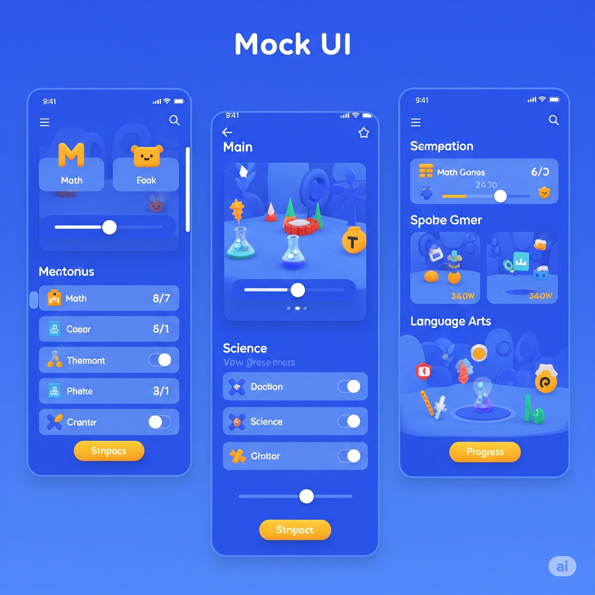

# Dragon Explorer

## 🌍 Proje Hakkında


Günümüzde eğitim teknolojileri hızla gelişse de, çocuklara yönelik etkileşimli, kişiselleştirilebilir ve çoklu duyusal deneyim sunan içerikler halen sınırlıdır. Özellikle coğrafya, kültürler arası farkındalık ve dil eğitimi alanlarında, çocukların ilgisini çekecek, onları eğlendirirken eğitecek platformlara duyulan ihtiyaç giderek artmaktadır.

Mevcut mobil uygulamaların çoğu ya çok basit ya da çok karmaşık bir yapıya sahiptir ve genellikle çocukların bireysel keşif süreçlerini desteklemez. Ayrıca VR (Sanal Gerçeklik) teknolojisi, henüz yeterince çocuk odaklı, oyunlaştırılmış projelerle bir araya getirilmemiştir.

Bu bağlamda, çocukların kendi ejderhalarını yönlendirdiği, VR teknolojisini SaaS altyapısı ile birleştiren, onlara özel bir keşif alanı sunacak yenilikçi bir mobil platform ihtiyacı ortaya çıkmıştır. Bu platformda çocuklar, ejderhalarıyla birlikte farklı kıtalar, ülkeler ve şehirler arasında uçarak yeni kültürleri tanır, farklı dilleri duyar, coğrafi keşiflerde bulunur. Ejderhalarını geliştirdikçe yeni beceriler kazanan çocuklar, eğlenirken öğrenir, oynarken kendilerini geliştirirler.

Proje Websitesi: https://kucuk-kasifler-atlasi.netlify.app

## UI Tasarımları



## 👤 Geliştirici

- **Furkan Melih Ercan**  
  Öğrenci No: 200542018  
  Bu projede tüm süreçlerden tek başıma sorumluydum; herhangi bir ekip arkadaşım bulunmamaktadır. Projenin dökümantasyonunun hazırlanması, yazılım geliştirme süreci, görevlerin belirlenip yönetilmesi ve projenin mantıksal tasarımı gibi tüm aşamalar tarafımdan gerçekleştirilmiştir.

## 📁 Proje Dosyaları

- **APK Dosyası**: `apk/dragon.apk`
- **Proje Videosu**: `dragonExplorer_demo_video.mp4`
- **Proje Dökümantasyonu**: `docs/ProjeDökümantasyonu.docx`

## 🧩 Proje Özellikleri

- **Artırılmış Gerçeklik (AR)**: Unity'nin AR Foundation paketi kullanılarak geliştirilmiştir.
- **Üç Farklı Aktör**:
  - **Admin**: Tüm kullanıcıların hareketlerini izleyebilir ve sistemi yönetebilir.
  - **Ebeveyn**: Yalnızca kendi çocuğuna ait verileri ve hareketleri görebilir.
  - **Çocuk (Player)**: Oyunu aktif şekilde oynayan kullanıcıdır.
- **SaaS Altyapısı**: Proje, tamamen SaaS (Software as a Service) altyapısına sahiptir ve kullanıcı dostu bir arayüz sunar.
- **Sağlık Takibi**: Çocuğun postürü bozulduğunda sistem uyarılar verir; ayrıca göz sağlığını korumak amacıyla belirli aralıklarla dinlenme önerileri sunulmaktadır.

## 🚀 Kurulum ve Çalıştırma

1. **Unity Sürümü**: Unity 2021.3 LTS veya daha yeni bir sürümünü kullanmanız önerilir.
2. **Projeyi Klonlayın**:
   ```bash
   git clone https://github.com/kullaniciadi/kucuk-kasifler-atlasi.git
   ```
3. **Unity ile Açın**: Unity Hub üzerinden projeyi açın.
4. **Gerekli Paketleri Yükleyin**: Proje açıldığında, eksik paketler otomatik olarak yüklenecektir.
5. **Ana Sahneyi Açın**: `src/Assets/Scenes/MainScene.unity` dosyasını açın.
6. **Projeyi Çalıştırın**: Unity Editor üzerinden sahneyi çalıştırarak projeyi test edebilirsiniz.

## 💻 Proje Kodları

`src/Assets` altında bulunan script dosyaları ve çalışma mantıkları:

### 🐉 DragonController.cs
Ejderha karakterinin kontrolünü sağlayan ana script. FixedJoystick kullanarak ejderhanın hareketini kontrol eder.

**Özellikler:**
- FixedJoystick ile hareket kontrolü
- Rigidbody tabanlı fizik sistemi
- Yön değiştirme (rotation) sistemi
- Hız ayarlanabilir parametresi

**Çalışma Mantığı:**
- `OnEnable()` metodunda joystick ve rigidbody bileşenlerini bulur
- `FixedUpdate()` metodunda joystick inputlarını alır
- X ve Z eksenlerinde hareket sağlar
- Hareket yönüne göre ejderhanın rotasyonunu ayarlar

### 🎮 Joystick Sistemi
`src/Assets/Joystick Pack/Scripts/` altında bulunan joystick kontrol sistemi.

**Ana Bileşenler:**
- **Joystick.cs** (Base): Temel joystick fonksiyonalitesi
- **DynamicJoystick.cs**: Dinamik joystick kontrolü
- **FixedJoystick.cs**: Sabit joystick kontrolü
- **FloatingJoystick.cs**: Yüzen joystick kontrolü
- **VariableJoystick.cs**: Değişken joystick kontrolü

**Çalışma Mantığı:**
- Pointer event'leri ile dokunmatik kontrol
- Dead zone ve handle range ayarları
- Axis options (Horizontal, Vertical, Both)
- Snap özelliği ile hassas kontrol

### 🏗️ PrefabCreator.cs
AR görüntü tanıma ile ejderha prefablarını oluşturan script.

**Özellikler:**
- ARTrackedImageManager entegrasyonu
- Otomatik prefab oluşturma
- Offset ayarlanabilir pozisyonlama

**Çalışma Mantığı:**
- AR görüntü tanındığında tetiklenir
- Belirlenen dragon prefabını instantiate eder
- Görüntü transform'una bağlar
- Offset ile pozisyon ayarlaması yapar

## 🎯 Teknoloji Stack

- **Unity 2021.3 LTS**: Ana geliştirme platformu
- **AR Foundation**: Artırılmış gerçeklik altyapısı
- **ARCore**: Android AR desteği
- **C#**: Programlama dili
- **Rigidbody Physics**: Fizik sistemi
- **UI Toolkit**: Kullanıcı arayüzü

## 📚 Dökümantasyon

Detaylı proje dökümantasyonuna `docs/ProjeDökümantasyonu.docx` dosyasından ulaşabilirsiniz.
